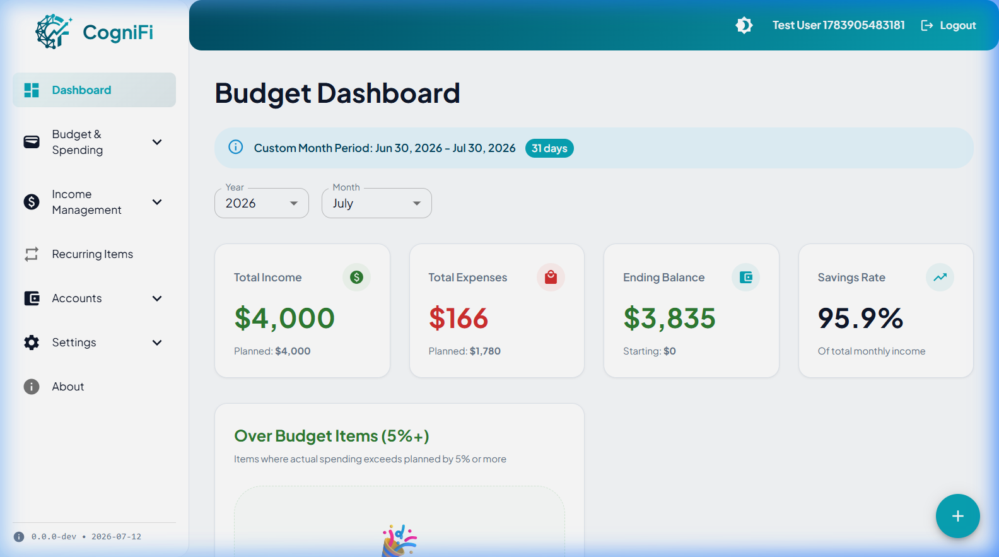
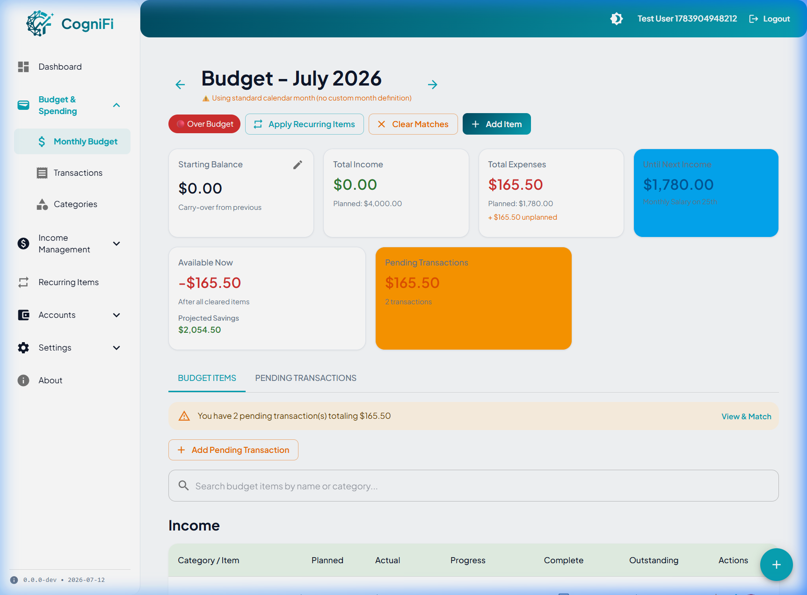
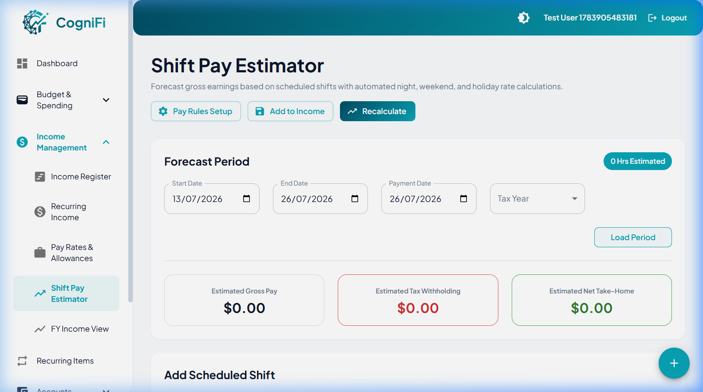
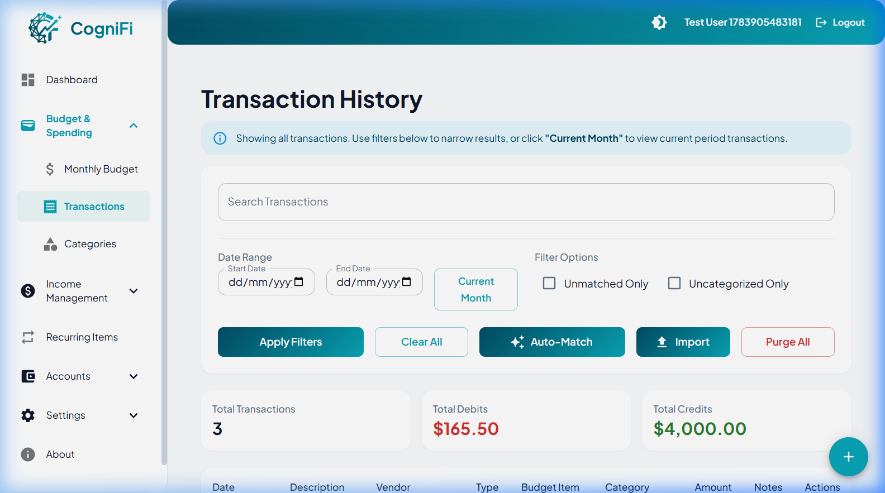
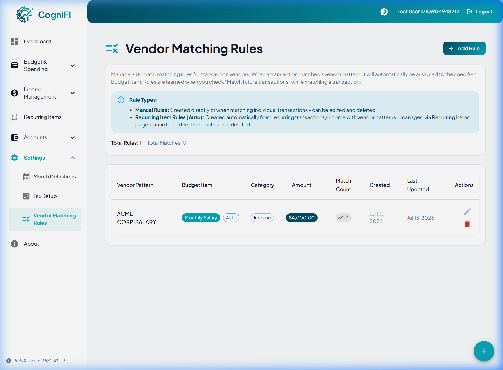

# CogniFi - Self-Hosted Personal Budgeting Application

CogniFi is a privacy-first, self-hosted personal finance and budgeting application designed to help individuals and families track income, expenses, and savings with powerful automation, intelligent matching features, and custom pay-cycle alignment.



---

## 🚀 Key Features

* **Smart Pay-Cycle Budgeting**: Align budget periods with your actual pay schedule (e.g., weekly, fortnightly, or custom calendars) rather than forcing everything into strict calendar months.
  
  

* **Dynamic Shift Pay Estimator**: Forecast gross earnings by entering shift hours and tags (`Day`, `Noon`, `Night`). The calculation engine automatically resolves complex base rates, shift allowances, cumulative or compounding multipliers (weekend/holiday), regional public holidays, and midnight crossover split-rate logic.
  
  

* **Intelligent Transaction Matching**: Import bank statements (CSV/QIF) and let the powerful rules engine automatically categorize transactions based on custom vendor matching rules.
  
  

* **Automated Vendor Rules**: Define custom matching rules to instantly categorize transactions on autopilot.
  
  

* **Household Budget Sharing & Collaboration**: Invite members, manage roles (`Owner`, `Admin`, `Member`, `Viewer`), and collaborate on budgeting within a shared workspace (Family/Professional tiers), with secure context isolation enforced via API middleware.
* **Multi-User Isolation & Collaboration**: Deploy a single instance with secure, isolated databases supporting multiple users and tiered accounts (Personal, Family, Professional).
* **Privacy & Control**: Maintain 100% ownership of your sensitive financial data on your own self-hosted infrastructure.

---

## 📦 Deployment Guide

CogniFi is distributed as a single lightweight Docker container containing both the React frontend and the .NET Web API. You can choose one of the following deployment paths:

*   **[Option A: One-Click Cloud Deployment (Render / Railway)](#option-a-one-click-cloud-deployment-render--railway)** (Recommended for non-technical users)
*   **[Option B: Self-Hosted Docker Compose (Local / VPS)](#option-b-self-hosted-docker-compose-local--vps)** (For developers and advanced users)

---

### Option A: One-Click Cloud Deployment (Render / Railway)

Get up and running in minutes without managing servers or command lines.

#### 1. Deploy to Render
Render is a unified cloud platform that builds and runs your apps. Our Render blueprint automatically provisions the container and attaches a persistent SSD disk for your database.

[](https://render.com/deploy?repo=https://github.com/FlexITCorp/cognifi-community)

1. Click the **Deploy to Render** button above.
2. Sign in or create a free Render account.
3. Render will read `render.yaml` and configure the service automatically.
4. It will auto-generate a secure `Jwt__Key` and attach a persistent 1GB disk mounted to `/app/data` to keep your SQLite database (`cognifi.db`) and license file safe across deployments.
5. Once deployment is complete, navigate to your Render service URL (e.g., `https://your-service.onrender.com/setup/startup-license`) to upload your license and complete the setup.

#### 2. Deploy to Railway
Railway is a modern hosting platform that makes it extremely simple to deploy applications.

[](https://railway.com/new?template=https://github.com/FlexITCorp/cognifi-community)

1. Click the **Deploy on Railway** button above.
2. Sign in or sign up to Railway.
3. Railway will clone the repository and start building.
4. **Important**: Once the project is created, you must configure a persistent volume to prevent data loss:
   - In the Railway project dashboard, click **+ New** (or press `Ctrl+K` / `Cmd+K`) and select **Volume**.
   - Attach the volume to your `cognifi-app` service.
   - Go to your service's **Settings** tab, locate **Volumes**, and set the Mount Path to `/app/data`.
5. Navigate to your Railway app's public URL at `/setup/startup-license` to upload your license and complete the setup.

---

### Option B: Self-Hosted Docker Compose (Local / VPS)

For users who want to host CogniFi on their own hardware or Virtual Private Server (VPS).

#### 1. Prerequisites
* **Docker & Docker Compose** installed on your host system.
* **A custom domain and reverse proxy** (e.g., Caddy, Nginx, or Traefik) configured with SSL.

#### 2. Create the Configuration
Create a directory on your host (e.g., `cognifi`) and add the following two files:


#### `docker-compose.yml`
```yaml
services:
  cognifi:
    build:
      context: ..
      dockerfile: Dockerfile
    image: ghcr.io/flexitcorp/cognifi-community:latest
    container_name: cognifi-app
    restart: unless-stopped
    
    ports:
      # Map container port 5000 to host port 8080
      - "8080:5000"
    
    volumes:
      # Persist SQLite database on host filesystem
      - ../data:/app/data
      # Persist application logs
      - ../logs:/app/logs
    
    environment:
      # Database configuration
      - DATABASE_PATH=/app/data/cognifi.db
      
      # JWT Authentication
      - Jwt__Key=${JWT_SECRET_KEY}
      - Jwt__Issuer=${JWT_ISSUER:-CogniFi}
      - Jwt__Audience=${JWT_AUDIENCE:-CogniFi}
      
      # Startup entitlement file paths
      - Licensing__StartupEntitlement__LicenseFilePath=/app/data/CogniFi-License.json
      - Licensing__StartupEntitlement__ReleaseManifestPath=/app/data/CogniFi-ReleaseManifest.json
      
      # ASP.NET Core settings
      - ASPNETCORE_ENVIRONMENT=Development
      - ASPNETCORE_URLS=http://+:5000
      
      # Enable legacy registration for test execution
      - Features__AllowLegacyRegistration=true
      
      # Disable rate limits during local test runs
      - RateLimiting__AuthLogin__PermitLimit=9999
      - RateLimiting__RegisterWithLicense__PermitLimit=9999
      - RateLimiting__StartupUpload__PermitLimit=9999
      - RateLimiting__AuthRefresh__PermitLimit=9999
      - RateLimiting__Entitlement__PermitLimit=9999
      - RateLimiting__LicenseApi__PermitLimit=9999
      - RateLimiting__ApiGeneral__PermitLimit=9999
      
      # Optional: Customize logging level
      - Logging__LogLevel__Default=Information
      - Logging__LogLevel__Microsoft.AspNetCore=Warning
      
      # Optional: Set timezone (default is UTC)
      - TZ=Australia/Sydney
    
    healthcheck:
      test: ["CMD", "wget", "--no-verbose", "--tries=1", "--spider", "http://localhost:5000/health"]
      interval: 30s
      timeout: 3s
      retries: 3
      start_period: 10s
    
    # Resource limits (optional - adjust based on your needs)
    deploy:
      resources:
        limits:
          memory: 512M
        reservations:
          memory: 256M
```
**[download docker-compose.yml](https://raw.githubusercontent.com/FlexITCorp/cognifi-community/main/docker-compose.yml)**

#### `.env`
Create a `.env` file in the same directory to define your secure secrets:
```env
# Secure JWT signing key (minimum 32 characters)
JWT_SECRET_KEY=your_super_secret_jwt_key_here_change_in_production
```

### 3. Start the Container
Run the following command to download and start the application in the background:
```bash
docker compose up -d
```
The application will listen on port `8080` inside the container network. Point your reverse proxy to forward traffic to `http://localhost:8080`.

---

## 🔑 Licensing & Registration

CogniFi uses an update-entitlement model. Active testers can download and run all releases published during their active license term. After expiration, the application continues to run, but upgrading to newer releases requires an active license.

### Obtain a Free Beta License
During the beta cohort phase, we are issuing **90-day time-limited Personal Tier licenses** to all active testers. 
- You can download the shared standard public beta key directly: **[Download CogniFi-License.json](https://raw.githubusercontent.com/FlexITCorp/cognifi-community/main/CogniFi-License.json)**.
- Alternatively, request your own unique key directly from the [🔑 How to Get Your Free 90-Day Beta License](https://github.com/FlexITCorp/cognifi-community/discussions/3) discussion thread.
- Save this file as `CogniFi-License.json` in your local directory (next to `docker-compose.yml`).

### First-Time Onboarding
1. When starting the application for the first time, navigate to `/setup/startup-license` in your browser.
2. Upload your signed license JSON file (`CogniFi-License.json`). This registers the update entitlement on your local instance.
3. Proceed to the Registration screen to create your admin account. The signup flow will automatically detect and associate the uploaded license.

For a comprehensive walkthrough of the onboarding wizard, configuration instructions, and features (like smart rules matching or weekly tracking), see the [Onboarding & FAQ Guide](USER_ONBOARDING_GUIDE.md).

---


## 🩺 Diagnostics & Health Checks

You can query the following endpoints to verify the status of your deployment:
* **Container Health**: `GET /health` (returns standard status and entitlement flags)
* **Entitlement Diagnostics**: `GET /api/entitlement-status` (details active license metadata, build date, and entitlement status)

---

## 🔮 Future Roadmap

We are actively developing new enhancements to expand CogniFi's capabilities. Here is what is planned for upcoming releases:


* **Advanced Reports & Insights (Analytics)**: Deep-dive spending trend charts, budget-to-actual variance analysis, and savings rate/net worth tracking.
* **Mortgage Management & Offset Tracking**: Australian market mortgage calculations, including offset accounts, redraw facility tracking, interest rate scenario models, and refinancing impact analysis.
* **Drag-and-Drop Transaction Categorization**: A visual workspace to drag imported bank transactions directly into category folders.
* **Streamlined Category Management**: A low-friction setup wizard and simplified interface to quickly add and structure budget categories without labor-intensive forms.
* **Automated Bank API Integration**: Connect directly to bank feeds to automate transaction imports alongside CSV and QIF uploads.
* **Mobile Applications**: Native iOS and Android apps featuring offline support, background synchronization, push notifications, and biometric authentication.

---

## 💬 Community & Feedback

Need help setting up your container, want to request a feature, or report a bug? Join the [CogniFi Discussions Community](https://github.com/FlexITCorp/cognifi-community/discussions)!
* **Questions & Setup Help**: Post a thread in the `Q&A` section.
* **Roadmap & Suggestions**: Share feature requests or suggest improvements under the [Roadmap & Suggestions](https://github.com/FlexITCorp/cognifi-community/discussions/2) discussion.
* **Technical Bugs**: Please report any non-critical technical bugs under the `Bug Reports` category.
